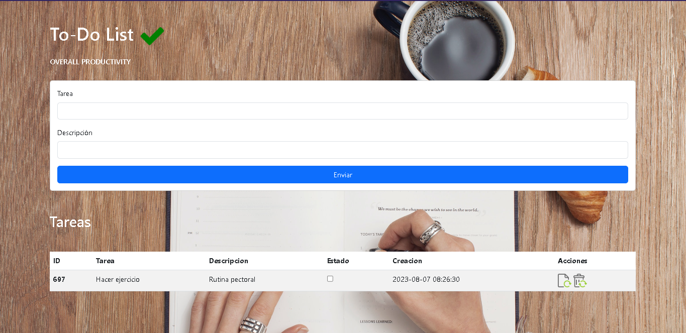

# TO-DO-LIST
Aplicacion de lista de tareas, para tener una rutina ordenada y productiva.

1- Primero para correr se necesita ejecutar la base de datos que se encuentra en
db/todolist.sql

2-Disfrutar de la app.

@Javier706
